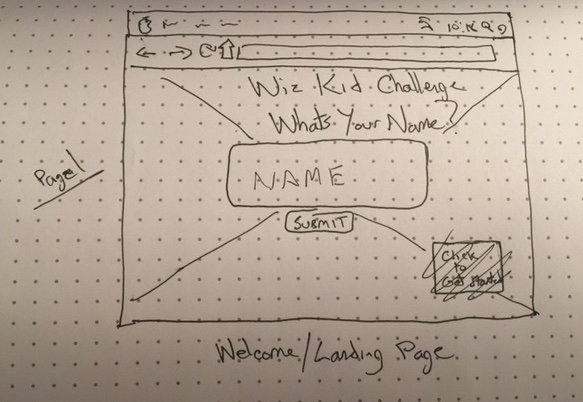
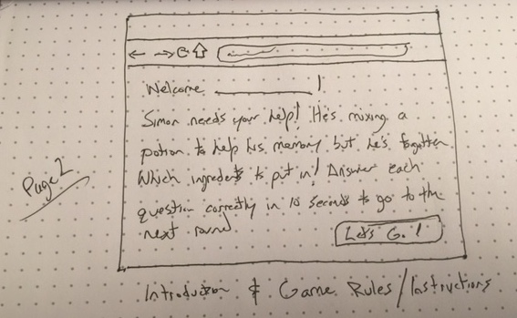
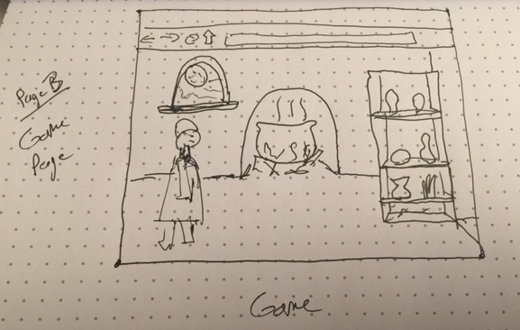
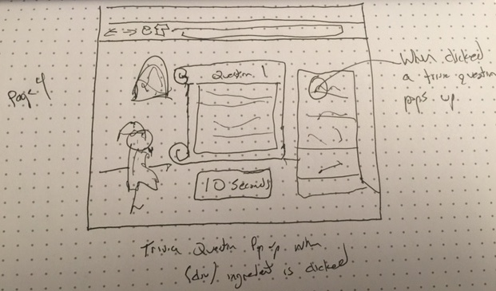

## About the game:
For ages 6-10
Trivia based game where users race against a clock to answer all _?_ questions to win the game.

## Synopsis:
Help! Simon the wizard has started creating a new potion and can't remember which ingredients need to be added!
Help Simon by answering questions in different categories like math and reading comprehension. For each question answered correctly, Simon will be able to add the right ingredient to his potion. You will have _?___ chances to answer correctly. 

## User Story 
Users should be able to navigate easily on the landing page inputting whatever information is required. Upon starting the game, users will learn that Simon the Wiz Kid needs help with creating his potion. Users will interact and answer questions in a sequential step process. For each correct answer, the users will level up until all the "ingredients" needed for Simons potion are finished and the game is complete.

## As a developer I want to make sure that styles and functions are correctly implemented so that user can easily interact with game in an intuitive and enjoyable way.

Trello Board: 
https://trello.com/b/Aes1fVF8/project-1

<figure>
	<figcaption>Wireframe 1</figcaption>
  
   
</figure>

<figure>
	<figcaption>Wireframe 2</figcaption>
  
   
</figure>

<figure>
	<figcaption>Wireframe 3</figcaption>
  
   
</figure>

<figure>
	<figcaption>Wireframe 4</figcaption>
  
   
</figure>

